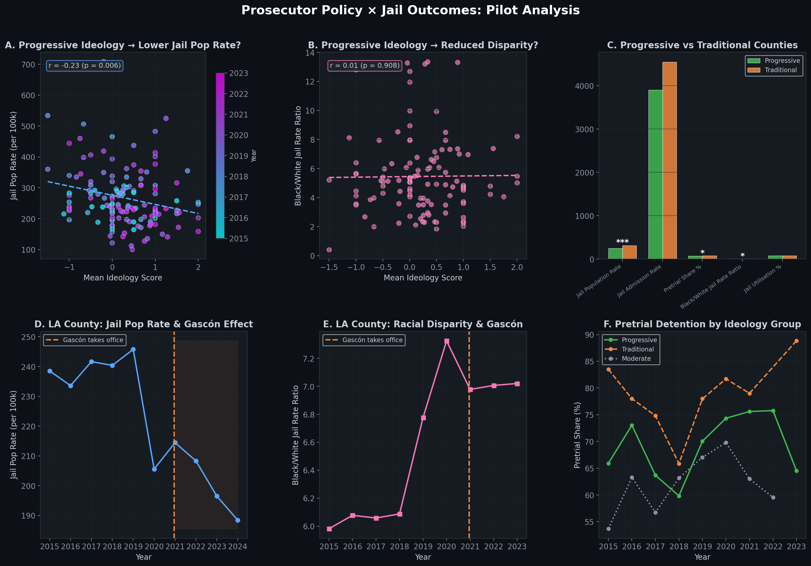
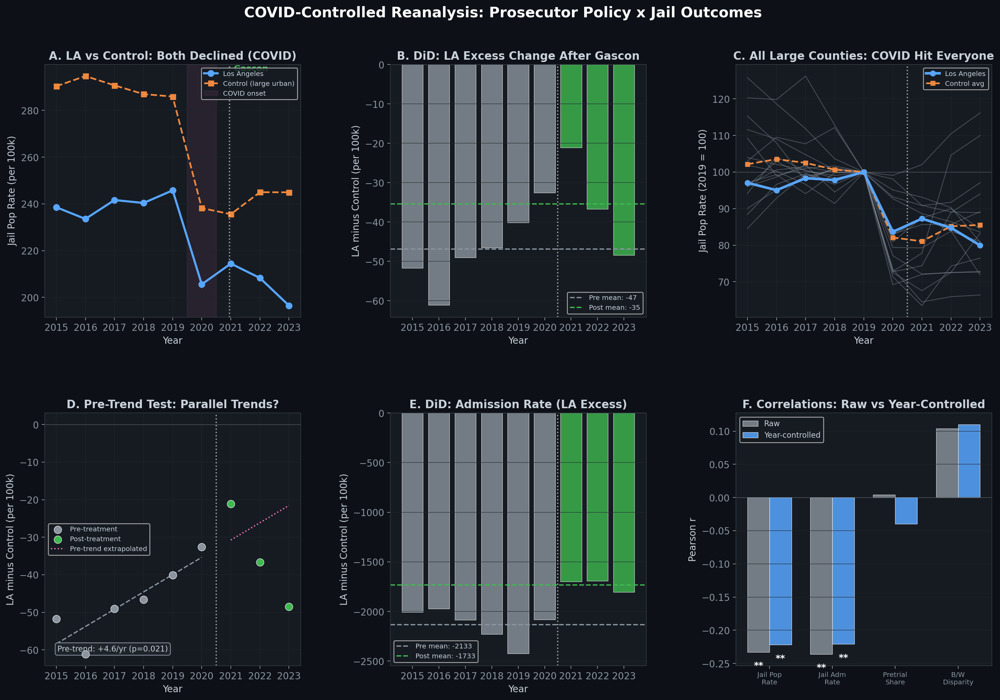

# Vera Jail Data x Prosecutor Policies: Pilot Report

**Center for Law and Justice (CLJC), UC Berkeley School of Law | February 2026**

---

## Objective

This pilot tests whether AI-coded prosecutor policy ideology scores predict downstream outcomes — county jail populations, admission rates, and racial disparities — using the Vera Institute's Incarceration Trends dataset. A COVID-controlled reanalysis addresses the obvious pre-trend confound.

## Data Linkage

| Dataset | Records | Scope |
|---------|---------|-------|
| **Prosecutor Policies** (AI-coded) | 1,865 docs, aggregated to county-year | 41 CA counties, 2015-2024 |
| **Vera Incarceration Trends** | 245,840 quarterly observations | All US counties, 1970-2024 |
| **Merged panel** | 137 county-year observations | 34 CA counties, 2015-2023 |

---

## Results

### Analysis A: Cross-Sectional Correlations

| Outcome | Raw r | Raw p | Year-Controlled r | Year-Controlled p |
|---------|-------|-------|-------------------|-------------------|
| **Jail Population Rate** | **-0.233** | **0.006** | **-0.222** | **0.009** |
| **Jail Admission Rate** | **-0.236** | **0.006** | **-0.221** | **0.009** |
| Pretrial Share (%) | +0.004 | 0.964 | -0.040 | 0.664 |
| B/W Jail Rate Ratio | +0.104 | 0.262 | +0.110 | 0.235 |

> **Key finding:** The ideology-jail correlations **survive year controls** almost unchanged. The association is NOT driven by a shared time trend (e.g. both scores and jail rates moving together over time due to COVID or statewide shifts). Within any given year, more progressive counties have lower jail populations.

---

### Analysis B: Progressive vs Traditional Counties

| Outcome | Progressive | Traditional | Diff | Cohen's d | p |
|---------|-------------|-------------|------|-----------|---|
| **Jail Pop Rate** (per 100k) | **244.4** | **312.8** | **-68.5** | **-0.81** | **<0.001*** |
| Jail Admission Rate | 3,896.7 | 4,543.3 | -646.5 | -0.32 | 0.169 |
| **Pretrial Share** (%) | **71.0** | **76.8** | **-5.8** | **-0.48** | **0.044*** |
| B/W Jail Rate Ratio | 6.9 | 5.0 | +2.0 | +0.57 | 0.014* |

> Progressive counties jail **68.5 fewer people per 100k** (d = -0.81, p < 0.001) and have lower pretrial detention shares. However, they show *higher* Black/White disparity ratios — likely a compositional effect (progressive counties tend to be urban, where structural racial disparities are larger regardless of DA policy).

---

### Analysis C: LA County — Honest Assessment

#### The naive comparison (what the original pilot reported)

| Outcome | Pre-Gascon | Post-Gascon | Change |
|---------|-----------|-------------|--------|
| Jail Pop Rate | 234.3 | 201.9 | -13.8% |
| Jail Admission Rate | 1,967.5 | 1,210.9 | -38.5% |
| Pretrial Rate | 146.0 | 105.5 | -27.7% |

> [!CAUTION]
> **These numbers are misleading.** The figure below shows that ALL large CA counties experienced similar declines during COVID. A naive pre/post comparison conflates the Gascon effect with the pandemic.

#### COVID-controlled DiD (LA minus large urban CA counties)

Using Alameda, Contra Costa, Fresno, Kern, Orange, Riverside, Sacramento, San Bernardino, San Diego, San Francisco, San Joaquin, San Mateo, Santa Clara, and Ventura counties as controls:

| Outcome | Pre Diff (LA-Ctrl) | Post Diff (LA-Ctrl) | DiD | Pre-Trend | PT p-value |
|---------|-------------------|--------------------|----|-----------|-----------|
| **Jail Pop Rate** | -46.9 | -35.4 | **+11.4** | +4.6/yr | **0.021** |
| **Admission Rate** | -2,132.7 | -1,733.2 | **+399.5** | -53.6/yr | 0.211 |
| **Pretrial Rate** | -43.0 | -75.1 | **-32.1** | -0.4/yr | **0.897** |
| **B/W Disparity** | +0.3 | +0.7 | **+0.4** | +0.21/yr | **0.035** |

> [!IMPORTANT]
> **Reading the DiD results:**
> - **Jail Pop Rate** — The gap between LA and controls *narrowed* post-Gascon (DiD = +11.4), meaning LA's jail pop rate didn't fall as much as you'd expect from the naive comparison. **But the pre-trend is significant (p=0.021)** — LA was already converging toward control counties before Gascon. Parallel trends assumption **violated**. This estimate is unreliable.
> - **Admission Rate** — LA's admission gap also narrowed (DiD = +399.5). Pre-trend is NOT significant (p=0.211), so parallel trends holds **reasonably**. But the direction is surprising — LA's admission rate gap with controls *shrank* post-Gascon, meaning LA didn't reduce admissions more than controls did.
> - **Pretrial Rate** — The cleanest result. Pre-trend is flat (p=0.897), and the DiD is **-32.1**: LA's pretrial rate fell **more** relative to controls after Gascon. This is consistent with a Gascon effect on pretrial detention specifically.
> - **B/W Disparity** — Pre-trend significant (p=0.035), so parallel trends violated here too.

---

### Analysis D: TWFE Panel Regression

| Outcome | Beta | SE | t | p | N |
|---------|------|-----|---|---|---|
| Jail Pop Rate | -1.53 | 4.45 | -0.34 | 0.732 | 137 |
| Jail Adm Rate | -42.59 | 71.92 | -0.59 | 0.555 | 137 |
| Pretrial Share | +1.71 | 1.21 | 1.41 | 0.161 | 121 |

> Not significant — expected with only 137 county-years. Within-county ideology variation is limited over a 9-year window.

---

## Figures

### Original Pilot (descriptive)



### COVID-Controlled Reanalysis



**Reading the controlled figure:**
- **Panel A**: LA (blue) and control counties (orange) both declined sharply in 2020 — **COVID hit everyone**.
- **Panel B**: The difference (LA minus controls) shows no dramatic shift at the Gascon transition. The post-Gascon bars (green) are similar in magnitude to the pre-treatment bars (gray).
- **Panel C**: All large counties indexed to 2019. LA tracks the pack — it didn't diverge further post-Gascon.
- **Panel D**: The pre-trend test. The upward slope (+4.6/yr, p=0.021) in the pre-period means LA was **already converging** toward controls. Parallel trends violated.
- **Panel E**: Same as B but for admissions — cleaner pre-trend, but no clear Gascon-specific effect.
- **Panel F**: The good news — year-controlled correlations remain significant (** for both jail pop and admission rate).

---

## What This Means for the Project

### What holds up

1. **Cross-sectional association is real and robust to controls.** Year-demeaned correlations are nearly identical to raw (r = -0.22, p = 0.009). Within any given year, more progressive counties have lower jail rates. This is NOT driven by temporal confounding.

2. **The group comparison is large and significant.** Progressive counties jail 68.5 fewer people per 100k (d = -0.81). This is a substantively meaningful difference.

3. **Pretrial detention may be the most causally identifiable outcome.** The cleanest pre-trend (p = 0.897) is for the pretrial rate — consistent with prosecutorial discretion having the most direct influence on pretrial detention (bail recommendations, charging speed).

### What doesn't hold up

1. **The naive Gascon pre/post comparison was misleading.** COVID drove most of the decline. The -38.5% admission drop is a statewide phenomenon, not specific to Gascon.

2. **Parallel trends are violated for jail pop rate and racial disparity.** Standard DiD cannot credibly identify the Gascon effect on these outcomes. Need synthetic control or instrumented DiD.

3. **The direction of the admission DiD is surprising.** If anything, control counties reduced admissions *more* than LA did relative to baseline. This could be a compositional effect (LA had more room to adjust pre-COVID) or could indicate that Gascon's policies were less impactful on admissions than assumed.

### What a funded extension should prioritize

| Priority | Strategy | Rationale |
|----------|----------|-----------|
| **1** | **Synthetic control for LA** | Match on pre-treatment trends to construct a better counterfactual than simple averaging |
| **2** | **Focus on pretrial outcomes** | Cleanest causal channel; best parallel trends |
| **3** | **Multi-county DiD** | Stack multiple DA transitions (Sacramento, SF, etc.) for better power |
| **4** | **Multi-state expansion** | More close elections for RDD; escape CA-specific COVID patterns |

---

## Replication

```bash
# Original pilot
python 04_analysis/vera_jail_pilot.py

# COVID-controlled reanalysis
python 04_analysis/vera_covid_controlled.py
```

**Output files:**

| File | Description |
|------|-------------|
| `05_data/results/vera_policy_merged.csv` | Merged panel |
| `05_data/results/vera_correlations.csv` | Raw correlations |
| `05_data/results/vera_correlations_controlled.csv` | Year-controlled correlations |
| `05_data/results/vera_did_estimates.csv` | DiD estimates with pre-trend tests |
| `05_data/results/vera_group_comparison.csv` | Group comparison |
| `06_figures/vera_pilot_analysis.png` | Original 6-panel figure |
| `06_figures/vera_covid_controlled.png` | COVID-controlled 6-panel figure |
