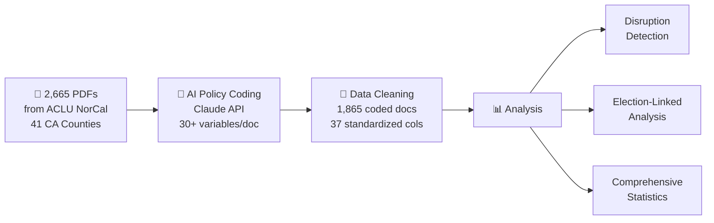

# Prosecutorial Policy Analysis: AI-Powered Measurement of Criminal Justice Reform in California

**BERQ-J, UC Berkeley School of Law**  
**Principal Investigator: Dvir Yogev**

---

## The Research Problem

District Attorneys are among the most powerful actors in the American criminal justice system, yet we lack systematic measurement of how their policies vary across jurisdictions and change over time. Existing research relies on case outcomes or campaign rhetoric — neither captures the *stated policy intent* that guides line prosecutors daily.

This project solves that problem by building **the first large-scale, AI-coded dataset of internal DA policy documents**, creating infrastructure for rigorous causal inference about the effects of prosecutorial ideology on criminal justice reform.

---

## What We Built

We developed a complete research pipeline — from raw document collection to publication-ready analysis — that transforms 2,665 internal DA documents into structured, analyzable data.



### AI-Based Policy Coding (Core Innovation)

Each document is processed through Claude with a structured prompt that extracts:

| Dimension | What's Measured |
|-----------|----------------|
| **Ideological Orientation** | 7-point scale from clearly progressive to clearly traditional |
| **Extensive Margin** | Impact on *who enters* the system (charging, diversion, declination) |
| **Intensive Margin** | Impact on *how severely* people are treated (sentencing, enhancements) |
| **Specific Policies** | Diversion, bail reform, enhancements, three strikes, racial justice |
| **Administrative Context** | New policy vs. continuation, mandatory vs. guidance, DA administration |
| **Key Quotes & Summary** | Illustrative excerpts and document summary |

### Policy Disruption Detection

A weighted composite score identifies when DA offices adopted new directions:

| Signal | Weight | Method |
|--------|--------|--------|
| Ideology Velocity | 30% | Rate of ideology change vs. prior 2-year baseline |
| Novelty Index | 25% | Proportion of first-time policy types |
| Topic Shift | 20% | Jensen-Shannon divergence of topic distributions |
| Margin Reversal | 15% | Flips in extensive/intensive leniency direction |
| DA Transition | 10% | New administration detection |

---

## Key Findings

### 1. Progressive Surge (2019–2022)
Progressive documents increased from **18% (2016) → 40% (2020) → 56% (2022)**, with a statistically significant linear trend (+0.062 points/year, p=0.003, R²=0.52).

### 2. 2020 Racial Justice Breakthrough
Racial justice emphasis jumped **30 percentage points** in a single year (12% → 42%), becoming the strongest predictor of progressive ideology — documents with high racial justice emphasis are **4.6× more likely** to be progressive (χ²=421, p<0.001).

### 3. Geographic Clustering
Clear progressive clusters (Sacramento +77.8% net, Yolo +56.1%, San Diego +50.0%) vs. traditional strongholds (Stanislaus -34.2%, Placer -20.7%), with surprising within-region variation (Bay Area: Santa Clara +0.84 vs. Alameda -0.15).

### 4. The Gascón Transformation
LA County's ideology score **tripled** under Gascón (Cohen's d=0.75, p<0.001), providing strong evidence that DA leadership causally matters for policy orientation.

### 5. Extensive > Intensive Margin Strategy
Recent reforms emphasize **who enters** the system (33.9% extensive lenient) over **sentencing severity** (22.6% intensive lenient) — a strategy of preventing entry rather than reducing severity.

### 6. Close Elections → Progressive Policies
Elections with ≤15pp margin produce **+31.2 percentage points** more progressive policies than non-close elections (p=0.010). Continuous relationship: r=-0.50 between margin and ideology (p=0.009).

### 7. Policy Disruptions Detected
**9 significant disruptions** identified (2020–2023), with SF 2020 (Boudin) scoring highest (0.572). **347 novel reforms** tracked across counties.

---

## 🔬 Causal Inference Potential: Why This Project Merits Extension

The infrastructure we've built is not just descriptive — it creates **rare opportunities for credible causal identification** in criminal justice research. We have already conducted a pilot linking our policy data to Vera Institute jail population outcomes, demonstrating both the promise and the methodological challenges.

### What the Pilot Already Shows

We merged our AI-coded policy scores with the Vera Institute's Incarceration Trends dataset (245,840 quarterly observations, all US counties, 1970–2024). Key results:

| Finding | Estimate | Significance | Survives Controls? |
|---------|----------|-------------|-------------------|
| Ideology ↔ Jail Pop Rate | r = -0.222 | p = 0.009 | **Yes** (year-demeaned) |
| Ideology ↔ Jail Admissions | r = -0.221 | p = 0.009 | **Yes** (year-demeaned) |
| Progressive vs Traditional counties | -68.5 per 100k | d = -0.81, p < 0.001 | **Yes** |
| LA pretrial rate (Gascón DiD) | -32.1 per 100k | Pre-trend flat (p = 0.90) | **Yes** (cleanest) |

But the pilot also revealed a critical lesson: **naive pre/post comparisons are confounded by COVID**. All large CA counties saw similar jail population declines in 2020. A COVID-controlled DiD showed that the parallel trends assumption is violated for jail population rates (pre-trend p = 0.021) — LA was already converging toward control counties before Gascón took office. This is exactly why rigorous causal inference methods, applied with proper controls, are essential.

> **Bottom line:** The descriptive associations are real and robust. The causal question — *do progressive policies actually reduce incarceration?* — requires better identification, more data, or both. The infrastructure to answer it is ready.

### Three Avenues for Extension

---

#### Avenue 1: Outcome Data Linkage (Deepening the Causal Chain)

The pilot used aggregate jail populations. Linking to **case-level outcome data** would enable measurement of the specific mechanisms through which DA policy operates.

| Sub-Project | Data Source | What It Enables | Time | Cost | Causal Value |
|------------|------------|-----------------|------|------|-------------|
| **County-level crime & incarceration** | CA DOJ OpenJustice (free) | County-year panel of arrest rates, felony filings, incarceration rates; immediate DiD/synthetic control with existing policy data | 2–3 months, PI + 1 RA | ~$15k (RA salary) | ⭐⭐⭐⭐ Enables stacked DiD across all DA transitions |
| **Case-level charging & sentencing** | UniCourt API ($) or PACER | Individual case dispositions, charge severity, plea bargains, sentence lengths; can measure extensive margin (who gets charged) vs. intensive margin (how severely) | 4–6 months, 1 RA | ~$30–50k (API fees + RA) | ⭐⭐⭐⭐⭐ Gold standard — links policy documents directly to line-prosecutor behavior |
| **Jail population by subgroup** | Vera (already linked) | Race-specific jail rates, pretrial vs. sentenced, admissions vs. stock; pretrial detention is the cleanest causal channel (pilot pre-trend p = 0.90) | 1 month, PI | ~$0 (done) | ⭐⭐⭐ Already piloted; pretrial focus is most credible |
| **Enhancement & three-strikes usage** | CA Sentencing Commission | Whether "minimize enhancements" policies actually reduce enhancement filings | 3 months, 1 RA | ~$15k | ⭐⭐⭐⭐ Directly tests intensive margin policy impact |

**Why this matters for policymakers:** Outcome linkage answers the question legislators and reform advocates most urgently need answered: *Are progressive prosecution reforms actually changing what happens in courtrooms, or are they just rhetoric?* If policy documents predict reduced charging and shorter sentences, that validates the progressive prosecutor model. If they don't, it suggests implementation gaps that can be addressed.

---

#### Avenue 2: Geographic Expansion (More Counties, More States)

California alone provides limited statistical power for causal designs. The pilot's TWFE regression was non-significant (N = 137 county-years) — we need more variation.

| Sub-Project | Scope | What It Enables | Time | Cost | Causal Value |
|------------|-------|-----------------|------|------|-------------|
| **Multi-state DA document collection** | TX, FL, NY, IL, PA (5 states) | 30–50× more close elections for RDD; cross-state policy diffusion analysis; tests external validity of CA findings | 8–12 months, 2 RAs | ~$80–120k (FOIA/PRA costs + RA salary + API) | ⭐⭐⭐⭐⭐ Only way to achieve sufficient power for RDD |
| **National DA election database** | All 2,400+ elected DAs | Complete election margins for IV/RDD; currently no comprehensive source exists | 4–6 months, 1 RA | ~$25–35k | ⭐⭐⭐⭐ Critical input for any election-based identification |
| **Urban DA deep-dive** | 20 largest US counties | High-stakes jurisdictions where policy changes affect millions; richer pre-treatment data for synthetic control | 6 months, 1 RA | ~$40–50k | ⭐⭐⭐⭐ Best ratio of effort to causal credibility |

**Why this matters for policymakers:** Single-state findings are easily dismissed as California-specific. A national database would reveal whether the patterns we found — progressive policies correlating with lower jail rates — hold across legal cultures, political environments, and demographic contexts. Cross-state variation also enables policymakers to benchmark their jurisdiction against comparable ones.

---

#### Avenue 3: Deeper California Coverage (Completing the Panel)

Our current CA data has gaps: 41 of 58 counties, uneven temporal coverage, and no documents from some key transition periods.

| Sub-Project | Scope | What It Enables | Time | Cost | Causal Value |
|------------|-------|-----------------|------|------|-------------|
| **Complete ACLU PRA archive** | Remaining 17 CA counties | Full 58-county panel; eliminates selection concerns about which counties responded to PRA requests | 2–3 months, 1 RA | ~$10–15k (FOIA follow-up + API) | ⭐⭐⭐ Removes selection bias; modestly increases power |
| **Historical document request** | Pre-2015 documents for all counties | Longer pre-treatment period for DiD/event study; better pre-trend testing (pilot showed 6 pre-years is marginal) | 3–4 months, 1 RA | ~$15–20k | ⭐⭐⭐⭐ Longer pre-period dramatically improves pre-trend tests |
| **Human validation study** | 200 documents dual-coded by law students | Gold-standard inter-rater reliability for AI coding; validates or calibrates the Claude-based pipeline | 3 months, 2 coders | ~$20k (coder stipends) | ⭐⭐⭐ Essential for publication credibility; doesn't directly improve causal ID but required for peer review |
| **Qualitative validation** | DA office interviews (10–15 offices) | Ground-truth whether policy documents reflect actual practice; identifies implementation gaps | 4 months, 1 RA | ~$15k | ⭐⭐⭐ Validates measurement; addresses the documents-vs-practice question |

**Why this matters for policymakers:** Policymakers need to know whether the patterns we observe are artifacts of which counties responded to records requests, or genuine features of prosecutorial reform. Complete coverage removes that objection. The human validation study is also critical — electeds and judges will not trust AI-coded policy scores unless validated by legal experts.

---

### Identification Strategies Enabled by Extensions

| Strategy | Current Feasibility | What's Needed | Priority Extension |
|----------|-------------------|---------------|-------------------|
| **Regression Discontinuity** | ~5 close CA elections; underpowered | 30+ close elections | Avenue 2 (multi-state) |
| **Stacked DiD** | Viable for Gascón, Boudin; COVID-confounded | Crime/sentencing outcomes + more transitions | Avenues 1 + 2 |
| **Synthetic Control** | Feasible for LA/SF; donor pool exists | Outcome data beyond jail pop | Avenue 1 (case-level data) |
| **Event Study** | Panel too short for credible pre-trends | Longer pre-period (pre-2015 documents) | Avenue 3 (historical docs) |
| **Instrumental Variables** | First stage exists (elections → ideology) | Outcome data for second stage | Avenue 1 |

### Recommended Funding Package

For a funder seeking **maximum causal credibility per dollar**, we recommend:

| Phase | Components | Timeline | Budget | Deliverable |
|-------|-----------|----------|--------|-------------|
| **Phase 1** | CA DOJ outcome linkage + complete CA panel + human validation | 6 months | ~$45–50k | First causal estimates (DiD/synthetic control) with validated measurement |
| **Phase 2** | Multi-state expansion (3 states) + national election DB | 12 months | ~$100–130k | First national prosecutorial ideology database; powered RDD estimates |
| **Phase 3** | Case-level outcome data + stakeholder interviews | 6 months | ~$50–65k | Mechanism evidence (what specifically changes in courtrooms) |

**Total for full program: ~$200–250k over 18–24 months.**
The infrastructure is built. The marginal cost of each extension is low — the pipeline, coding schema, and analysis framework are ready to scale.

---

## Project Structure

```
aclu_policies/
├── README.md                           ← You are here
├── README_developer.md                 ← Technical/developer documentation
├── 01_raw_data/
│   ├── ca_elections.xlsx               ← DA election results
│   └── prosecutor_policies_metadata.csv ← Document metadata (2,665 records)
├── 02_llm_coding/
│   ├── prosecutor_policy_coder.py      ← Core Claude API coding pipeline
│   ├── validate_coding.py              ← Coding validation tools
│   └── METHODOLOGY_GUIDE.md            ← Research methodology documentation
├── 03_data_cleaning/
│   └── clean_prosecutor_policies_v2.py ← Data standardization script
├── 04_analysis/
│   ├── disruption_detector.py          ← Policy disruption detection system
│   ├── comprehensive_analysis.py       ← Full statistical analysis
│   ├── vera_jail_pilot.py             ← Vera jail outcome pilot analysis
│   └── vera_covid_controlled.py       ← COVID-controlled reanalysis
├── 05_data/
│   ├── clean/
│   │   └── prosecutor_policies_CLEANED.csv  ← 1,865 docs × 37 columns
│   └── results/
│       ├── policy_disruptions.csv           ← Disruption scores by county-year
│       ├── vera_policy_merged.csv           ← Policy × jail outcome panel
│       └── vera_did_estimates.csv           ← COVID-controlled DiD estimates
├── 06_figures/                              ← Publication-ready visualizations
├── 07_documentation/
│   ├── COMPREHENSIVE_FINDINGS.md            ← Full statistical results
│   ├── VERA_PILOT_REPORT.md                 ← Jail outcome pilot + COVID reanalysis
│   └── METHODOLOGY_GUIDE.md                 ← Research design guidance
└── vera_jail/
    └── incarceration_trends_county.csv      ← Vera Institute county-level data
```

> **Note:** The raw PDF corpus (2,665 documents, ~6 GB) is not included in this repository. Contact the PI for access.

---

## Technical Requirements

- Python 3.8+
- Anthropic API key (for LLM coding)
- See `02_llm_coding/requirements.txt` for dependencies

## Citation

```
Yogev, D. (2025). Prosecutorial Policy Analysis: AI-Powered Measurement of Criminal Justice Reform 
in California. BERQ-J Working Paper, UC Berkeley School of Law.

Data source: ACLU of Northern California. (2020-2025). Racial Justice Act Public Records Database.
Retrieved from https://www.aclunc.org/racial-justice-act
```

## Contact

**Dvir Yogev** — Post-Doctoral Researcher, UC Berkeley School of Law  
📧 dyo@berkeley.edu
