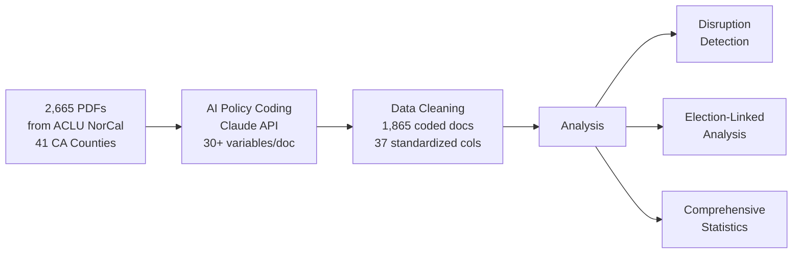

# Prosecutorial Policy Analysis: AI-Powered Measurement of Criminal Justice Reform in California

**Center for Law and Justice (CLJC), UC Berkeley School of Law**  
**Principal Investigator: Dvir Yogev**

---

## The Research Problem

District Attorneys are among the most powerful actors in the American criminal justice system, yet we lack systematic measurement of how their policies vary across jurisdictions and change over time. Existing research relies on case outcomes or campaign rhetoric — neither captures the *stated policy intent* that guides line prosecutors daily.

This project solves that problem by building **the first large-scale, AI-coded dataset of internal DA policy documents**, creating infrastructure for rigorous causal inference about the effects of prosecutorial ideology on criminal justice reform.

---

## What We Built

We developed a complete research pipeline — from raw document collection to publication-ready analysis — that transforms 2,665 internal DA documents into structured, analyzable data.



### AI-Based Policy Coding (Core Innovation)

Each document is processed through Claude with a structured prompt that extracts:

| Dimension | What's Measured |
|-----------|----------------|
| **Ideological Orientation** | 7-point scale from clearly progressive to clearly traditional |
| **Extensive Margin** | Impact on *who enters* the system (charging, diversion, declination) |
| **Intensive Margin** | Impact on *how severely* people are treated (sentencing, enhancements) |
| **Specific Policies** | Diversion, bail reform, enhancements, three strikes, racial justice |
| **Administrative Context** | New policy vs. continuation, mandatory vs. guidance, DA administration |
| **Key Quotes & Summary** | Illustrative excerpts and document summary |

> For details on the LLM coding system, prompts, and pipeline: [02_llm_coding/README.md](02_llm_coding/README.md) | For methodology and research design guidance: [METHODOLOGY_GUIDE.md](02_llm_coding/METHODOLOGY_GUIDE.md) | For getting started with the pipeline: [GETTING_STARTED.md](02_llm_coding/GETTING_STARTED.md)

### Policy Disruption Detection

A weighted composite score identifies when DA offices adopted new directions:

| Signal | Weight | Method |
|--------|--------|--------|
| Ideology Velocity | 30% | Rate of ideology change vs. prior 2-year baseline |
| Novelty Index | 25% | Proportion of first-time policy types |
| Topic Shift | 20% | Jensen-Shannon divergence of topic distributions |
| Margin Reversal | 15% | Flips in extensive/intensive leniency direction |
| DA Transition | 10% | New administration detection |

> For detailed disruption detection results and methodology: [05_data/results/README.md](05_data/results/README.md)

---

## Key Findings

### Face Validity: The Pipeline Recovers Known Patterns

These findings align with common wisdom about the progressive prosecutor movement and provide confidence that the AI coding system is measuring real variation.

**The Gascón Transformation.** LA County's ideology score **tripled** under Gascón (Cohen's d=0.75, p<0.001). George Gascón ran on the most explicitly progressive platform and implemented the most sweeping reforms of any major-jurisdiction DA — our pipeline captures this as a massive, statistically significant shift. This is exactly the ground truth we would expect a well-calibrated measurement to recover.

**Geographic Clustering.** Progressive clusters emerge where we expect them: Sacramento (+77.8% net progressive), Yolo (+56.1%), San Diego (+50.0%). Traditional strongholds also align with priors: Stanislaus (-34.2%), Placer (-20.7%). The pipeline also captures surprising within-region variation (Bay Area: Santa Clara +0.84 vs. Alameda -0.15) — consistent with known differences in those offices that would not be captured by region-level assumptions alone.

**The 2020 Racial Justice Breakthrough.** Racial justice emphasis jumped **30 percentage points** in a single year (12% to 42%), becoming the strongest predictor of progressive ideology (documents with high racial justice emphasis are 4.6x more likely to be progressive; chi-squared=421, p<0.001). This tracks precisely with the post-George Floyd moment that reshaped criminal justice rhetoric and policy nationwide — again confirming that the pipeline is capturing real-world dynamics rather than coding noise.

### Descriptive Analysis: Theory-Grounded Patterns

Beyond validating the pipeline, the data reveals patterns grounded in theories of prosecutorial behavior and electoral accountability.

**Extensive > Intensive Margin Strategy.** Recent reforms disproportionately emphasize **who enters** the system (33.9% extensive lenient) over **how severely** people are treated (22.6% intensive lenient). This is consistent with a political economy logic: diversion and declination policies are less visible to voters and interest groups than sentencing leniency, making them safer reforms for DAs facing reelection. This extensive-over-intensive pattern is a novel descriptive finding that has not been documented at this scale.

**Close Elections and Progressive Policy.** Elections with margins of 15pp or less produce **+31.2 percentage points** more progressive policies than non-close elections (p=0.010). The continuous relationship is strong: r=-0.50 between margin and ideology (p=0.009). Tighter races appear to select for or empower DAs who implement more progressive agendas — consistent with models where electoral competition disciplines incumbents (or attracts challengers) around policy substance rather than just partisanship. This election-ideology link also provides the first stage for potential instrumental variables designs.

> For complete election analysis with case studies and robustness checks: [FINAL_ANALYSIS_SUMMARY.md](07_documentation/FINAL_ANALYSIS_SUMMARY.md) | For the full election output guide: [ELECTION_ANALYSIS_README.md](07_documentation/ELECTION_ANALYSIS_README.md)

### In the Service of Causal Inference: Policy Shocks

The pipeline enables detection and measurement of sharp policy transitions — critical inputs for event-study and difference-in-differences designs.

**Policy Disruptions Detected.** Our disruption detection system identified **9 significant policy disruptions** (2020–2023). San Francisco 2020 (Boudin) scored highest (0.572), followed by LA County 2021 (Gascón). The system tracked **347 novel reform adoptions** across counties. These discontinuities are exactly the quasi-experimental variation that causal designs require — each transition represents a potential "natural experiment" where a DA office sharply changed course.

**Progressive Surge (2019–2022).** Progressive documents increased from 18% (2016) to 40% (2020) to 56% (2022), a statistically significant linear trend (+0.062 points/year, p=0.003, R-squared=0.52). The temporal pattern — gradual trend punctuated by sharp county-level disruptions — creates the kind of staggered adoption variation that powers modern stacked DiD and event study designs.

> For full statistical results (6 major findings with statistical tests, effect sizes, and geographic breakdowns): [COMPREHENSIVE_FINDINGS.md](07_documentation/COMPREHENSIVE_FINDINGS.md)

### Jail Data Pilot: First Steps Toward Causal Evidence

We merged our AI-coded policy scores with the Vera Institute's Incarceration Trends dataset (245,840 quarterly observations, all US counties, 1970–2024) to test whether stated policy ideology predicts downstream incarceration outcomes. This pilot represents the closest existing evidence linking DA policy *documents* to population-level criminal justice outcomes.

**What survives scrutiny:**

| Finding | Estimate | Significance | Survives Controls? |
|---------|----------|-------------|-------------------|
| Ideology and Jail Pop Rate | r = -0.222 | p = 0.009 | **Yes** (year-demeaned) |
| Ideology and Jail Admissions | r = -0.221 | p = 0.009 | **Yes** (year-demeaned) |
| Progressive vs Traditional counties | -68.5 per 100k | d = -0.81, p < 0.001 | **Yes** |
| LA pretrial rate (Gascon DiD) | -32.1 per 100k | Pre-trend flat (p = 0.90) | **Yes** (cleanest) |

The cross-sectional correlations **hold after controlling for year fixed effects** — the association between progressive policy and lower jail rates is not an artifact of temporal trends or COVID. Progressive counties jail **68.5 fewer people per 100k** than traditional counties (d = -0.81). The pretrial detention result is particularly notable: parallel trends hold cleanly (p = 0.90), and pretrial detention is the outcome most directly within prosecutorial discretion.

**What the pilot exposes honestly:** Naive pre/post comparisons are **confounded by COVID** — all large CA counties saw similar jail population declines in 2020. A COVID-controlled DiD showed that the parallel trends assumption is violated for jail population rates (pre-trend p = 0.021). The TWFE panel regression was non-significant (N = 137 county-years). These are not failures — they are precisely the diagnostics that tell us what data and designs are needed to move from robust descriptive associations to credible causal claims.

**Why this matters for policy:** The descriptive associations are real. The causal question — *do progressive policies actually reduce incarceration?* — remains open and answerable with the right extensions. This is a gap that, if filled, would provide the first evidence base for evaluating the progressive prosecutor model on its own terms.

> For complete Vera pilot methodology, COVID-controlled reanalysis, and figures: [VERA_PILOT_REPORT.md](07_documentation/VERA_PILOT_REPORT.md)

---

## Causal Inference Potential: A Deep Dive on What's Possible

The infrastructure above creates **rare opportunities for credible causal identification** in criminal justice research. Two categories of extension would unlock the full potential: expanding *policy coverage* (more DA offices, more documents) and expanding *outcome data* (linking policies to case-level and population-level justice outcomes).

### Extension 1: Expanding Policy Coverage

Our current corpus covers 41 of 58 California counties. Expanding coverage increases statistical power, enables better pre-trend testing, and addresses selection concerns about which counties responded to records requests.

**Within California.** Completing the remaining **17 CA counties** through follow-up PRA requests and archival collection would yield a full 58-county panel, eliminating non-response selection bias. Requesting **pre-2015 historical documents** would extend the pre-treatment period — the pilot showed that 6 pre-years is marginal for credible pre-trend tests. A **human validation study** (200 documents dual-coded by trained law students) would establish gold-standard inter-rater reliability for the AI coding, which is essential for publication credibility and policy uptake.

**Nationally: 100 Largest DA Offices.** The most impactful expansion would be collecting internal policy documents from the **100 largest DA offices** nationwide (covering approximately 65% of the U.S. population). These offices have the highest caseloads, the most at stake, and — critically — the most DA transitions available for causal designs. This would provide 30–50 close elections (currently ~5 in CA alone), enough to power a regression discontinuity design, the cleanest available causal identification strategy. Multi-state coverage also tests whether our California findings — progressive policies correlating with lower jail rates — hold across different legal cultures, political environments, and demographic contexts.

| Scope | Scale | Enables | Time | Cost |
|-------|-------|---------|------|------|
| Complete CA (17 counties + historical) | ~500 additional documents | Full panel; longer pre-periods; removes selection bias | 4–6 months | ~$25–35k |
| 100 largest US DA offices | ~5,000–10,000 new documents | 30+ close elections for RDD; national benchmarking; external validity | 12–18 months | ~$100–150k |
| Human validation (200 docs) | 200 dual-coded documents | Inter-rater reliability; publication credibility | 3 months | ~$20k |

### Extension 2: Merging with Outcome Data

The pilot used aggregate county-level jail populations — useful for proof-of-concept, but too coarse to identify the specific mechanisms through which DA policy operates. Several outcome datasets would sharpen both the causal identification and the policy relevance.

**Administrative Outcome Data (Available Now)**

| Data Source | Records | What It Tests | Access |
|------------|---------|--------------|--------|
| **CA DOJ OpenJustice** | County-year arrest, filing, incarceration rates | Whether progressive policies reduce total system contact | Free; public API |
| **CA Sentencing Commission** | Enhancement filings, three-strikes usage by county-year | Whether "minimize enhancements" memos actually reduce enhancement usage | Data request |
| **Vera Incarceration Trends** (already linked) | Quarterly jail pop by county, subgroup | Pretrial detention is cleanest causal channel (pre-trend p = 0.90) | Done |

**Case-Level Data (Higher Investment, Higher Return)**

| Data Source | Records | What It Tests | Access | Cost |
|------------|---------|--------------|--------|------|
| **UniCourt / PACER** | Individual case dispositions, charge severity, plea bargains, sentence lengths | Do policy memos change line-prosecutor *behavior*? Extensive vs. intensive margin mechanisms | API subscription | ~$30–50k |
| **CJARS** (Criminal Justice Administrative Records System) | Individual-level records tracking arrest through court filings, incarceration, probation, and parole across 24 states | Whether policy changes alter *individual trajectories* through the justice system — not just aggregate counts but recidivism, time-to-disposition, and sentencing variation at the person level | Census Bureau FSRDC application (3–12 month approval) | FSRDC fees only |

**CJARS** is a particularly compelling match for this project. The system — a collaboration between the U.S. Census Bureau and the University of Michigan — harmonizes criminal justice records from 24 states into a longitudinal, individual-level dataset. Because CJARS tracks individuals from arrest through parole, it enables analysis that aggregate data cannot: testing whether a progressive DA's diversion policy memo actually reduces the probability that an individual who is arrested proceeds to prosecution, or whether a sentencing reform memo shortens the average incarceration spell. CJARS data can also be linked anonymously with Census Bureau demographic and economic records, enabling analysis of heterogeneous effects across race, income, and employment status. Access is through the Federal Statistical Research Data Center (FSRDC) network, with an application process of 3–12 months.

### Overcoming the Limitations of the Jail Data Pilot

The pilot's main weaknesses — COVID confounding, violated parallel trends, and insufficient power — are each addressable with specific data investments:

| Pilot Limitation | Root Cause | Solution |
|-----------------|------------|----------|
| COVID confounds naive DiD | All CA counties declined simultaneously in 2020 | Multi-state data diversifies away from CA-specific COVID timing; synthetic control matches on pre-treatment trajectories |
| Parallel trends violated (p = 0.021) for jail pop rate | LA was already converging toward controls pre-Gascon | Longer pre-period (pre-2015 docs) + case-level data (not confounded by same aggregate statewide trends) |
| TWFE non-significant (N = 137) | Only 34 counties, 9 years — too few county-years | National expansion to 100 offices dramatically increases N and DA transition events |
| Aggregate jail data too coarse | Cannot distinguish charging vs. sentencing mechanisms | Case-level outcome data (UniCourt, CJARS) enables mechanism decomposition |

### Related Work: Exploiting Internal Memos for Causal Designs

Our approach connects to an emerging research agenda on using internal policy documents for causal identification. Felix Owusu's project, funded by Arnold Ventures, exploits two specific internal DA policy memos to construct a causal design estimating their effects on criminal justice outcomes. [Placeholder — details of design and findings to be discussed verbally.] Our contribution scales this logic: rather than relying on a small number of memos from individual offices, we provide **systematic measurement across 41+ offices and 1,865 documents**, creating the variation needed to estimate average causal effects and explore heterogeneity.

### Value for Policymakers and Practitioners

This project can produce actionable intelligence that does not currently exist:

- **DA accountability scorecards.** Systematic, comparable measures of how each office's stated policies align with its stated goals — enabling voters, oversight bodies, and reform advocates to evaluate DA offices on their own terms.
- **Evidence on whether reform rhetoric translates to reform practice.** By linking policy documents to case-level outcomes, we can test whether a DA who issues a "decline to prosecute low-level drug offenses" memo actually sees fewer drug prosecutions — or whether the memo is just signaling.
- **Benchmarking tools.** A DA office considering a bail reform policy could see how similar policies were implemented in comparable jurisdictions, what the measured effects were, and what lessons other offices learned.
- **Causal evidence on the progressive prosecutor model.** The central policy question — does electing a progressive DA actually reduce incarceration and improve equity? — is answerable with the extensions described above. Credible causal estimates would inform the ongoing national debate about prosecutorial reform, district-level advocacy, and funding allocation.

### Recommended Funding Package

For maximum causal credibility per dollar, we recommend a phased approach:

| Phase | Components | Timeline | Budget | Deliverable |
|-------|-----------|----------|--------|-------------|
| **Phase 1** | CA DOJ outcome linkage + complete CA panel + human validation | 6 months | ~$45–50k | First causal estimates (DiD/synthetic control) with validated measurement |
| **Phase 2** | National expansion (100 largest DA offices) + election DB + CJARS application | 12–18 months | ~$100–150k | First national prosecutorial ideology database; powered RDD estimates |
| **Phase 3** | Case-level outcome data (UniCourt/CJARS) + stakeholder interviews | 6–12 months | ~$50–65k | Mechanism evidence: what specifically changes in courtrooms |

**Total: ~$200–265k over 24–36 months.** The infrastructure is built. The marginal cost of each extension is low — the pipeline, coding schema, and analysis framework are ready to scale.

---

## Project Structure

```
aclu_policies/
├── README.md                           ← You are here
├── README_developer.md                 ← Technical/developer documentation
├── 01_raw_data/
│   ├── ca_elections.xlsx               ← DA election results
│   └── prosecutor_policies_metadata.csv ← Document metadata (2,665 records)
├── 02_llm_coding/
│   ├── prosecutor_policy_coder.py      ← Core Claude API coding pipeline
│   ├── validate_coding.py              ← Coding validation tools
│   └── METHODOLOGY_GUIDE.md            ← Research methodology documentation
├── 03_data_cleaning/
│   └── clean_prosecutor_policies_v2.py ← Data standardization script
├── 04_analysis/
│   ├── disruption_detector.py          ← Policy disruption detection system
│   ├── comprehensive_analysis.py       ← Full statistical analysis
│   ├── vera_jail_pilot.py             ← Vera jail outcome pilot analysis
│   └── vera_covid_controlled.py       ← COVID-controlled reanalysis
├── 05_data/
│   ├── clean/
│   │   └── prosecutor_policies_CLEANED.csv  ← 1,865 docs × 37 columns
│   └── results/
│       ├── policy_disruptions.csv           ← Disruption scores by county-year
│       ├── vera_policy_merged.csv           ← Policy × jail outcome panel
│       └── vera_did_estimates.csv           ← COVID-controlled DiD estimates
├── 06_figures/                              ← Publication-ready visualizations
├── 07_documentation/
│   ├── COMPREHENSIVE_FINDINGS.md            ← Full statistical results
│   ├── VERA_PILOT_REPORT.md                 ← Jail outcome pilot + COVID reanalysis
│   └── METHODOLOGY_GUIDE.md                 ← Research design guidance
└── vera_jail/
    └── incarceration_trends_county.csv      ← Vera Institute county-level data
```

**Additional documentation** (not shown in tree): [Data cleaning documentation](03_data_cleaning/README.md) | [Analysis deliverables overview](04_analysis/README.md) | [Data cleaning summary](07_documentation/PROJECT_SUMMARY.md)

> **Note:** The raw PDF corpus (2,665 documents, ~6 GB) is not included in this repository. Contact the PI for access.

---

## Technical Requirements

- Python 3.8+
- Anthropic API key (for LLM coding)
- See `02_llm_coding/requirements.txt` for dependencies

## Citation

```
Yogev, D. (2026). Prosecutorial Policy Analysis: AI-Powered Measurement of Criminal Justice Reform 
in California. Working Paper, Center for Law and Justice, UC Berkeley School of Law.

Data source: ACLU of Northern California. (2020-2026). Racial Justice Act Public Records Database.
Retrieved from https://www.aclunc.org/racial-justice-act
```

## Contact

**Dvir Yogev** — Post-Doctoral Researcher, UC Berkeley School of Law  
dyo@berkeley.edu
