# Prosecutorial Policy Analysis: AI-Powered Measurement of Criminal Justice Reform in California

**BERQ-J, UC Berkeley School of Law**  
**Principal Investigator: Dvir Yogev**

---

## The Research Problem

District Attorneys are among the most powerful actors in the American criminal justice system, yet we lack systematic measurement of how their policies vary across jurisdictions and change over time. Existing research relies on case outcomes or campaign rhetoric — neither captures the *stated policy intent* that guides line prosecutors daily.

This project solves that problem by building **the first large-scale, AI-coded dataset of internal DA policy documents**, creating infrastructure for rigorous causal inference about the effects of prosecutorial ideology on criminal justice reform.

---

## What We Built

We developed a complete research pipeline — from raw document collection to publication-ready analysis — that transforms 2,665 internal DA documents into structured, analyzable data.

```mermaid
flowchart LR
    A["📄 2,665 PDFs\nfrom ACLU NorCal\n41 CA Counties"] --> B["🤖 AI Policy Coding\nClaude API\n30+ variables/doc"]
    B --> C["🧹 Data Cleaning\n1,865 coded docs\n37 standardized cols"]
    C --> D["📊 Analysis"]
    D --> E["Disruption\nDetection"]
    D --> F["Election-Linked\nAnalysis"]
    D --> G["Comprehensive\nStatistics"]
```



### AI-Based Policy Coding (Core Innovation)

Each document is processed through Claude with a structured prompt that extracts:

| Dimension | What's Measured |
|-----------|----------------|
| **Ideological Orientation** | 7-point scale from clearly progressive to clearly traditional |
| **Extensive Margin** | Impact on *who enters* the system (charging, diversion, declination) |
| **Intensive Margin** | Impact on *how severely* people are treated (sentencing, enhancements) |
| **Specific Policies** | Diversion, bail reform, enhancements, three strikes, racial justice |
| **Administrative Context** | New policy vs. continuation, mandatory vs. guidance, DA administration |
| **Key Quotes & Summary** | Illustrative excerpts and document summary |

### Policy Disruption Detection

A weighted composite score identifies when DA offices adopted new directions:

| Signal | Weight | Method |
|--------|--------|--------|
| Ideology Velocity | 30% | Rate of ideology change vs. prior 2-year baseline |
| Novelty Index | 25% | Proportion of first-time policy types |
| Topic Shift | 20% | Jensen-Shannon divergence of topic distributions |
| Margin Reversal | 15% | Flips in extensive/intensive leniency direction |
| DA Transition | 10% | New administration detection |

---

## Key Findings

### 1. Progressive Surge (2019–2022)
Progressive documents increased from **18% (2016) → 40% (2020) → 56% (2022)**, with a statistically significant linear trend (+0.062 points/year, p=0.003, R²=0.52).

### 2. 2020 Racial Justice Breakthrough
Racial justice emphasis jumped **30 percentage points** in a single year (12% → 42%), becoming the strongest predictor of progressive ideology — documents with high racial justice emphasis are **4.6× more likely** to be progressive (χ²=421, p<0.001).

### 3. Geographic Clustering
Clear progressive clusters (Sacramento +77.8% net, Yolo +56.1%, San Diego +50.0%) vs. traditional strongholds (Stanislaus -34.2%, Placer -20.7%), with surprising within-region variation (Bay Area: Santa Clara +0.84 vs. Alameda -0.15).

### 4. The Gascón Transformation
LA County's ideology score **tripled** under Gascón (Cohen's d=0.75, p<0.001), providing strong evidence that DA leadership causally matters for policy orientation.

### 5. Extensive > Intensive Margin Strategy
Recent reforms emphasize **who enters** the system (33.9% extensive lenient) over **sentencing severity** (22.6% intensive lenient) — a strategy of preventing entry rather than reducing severity.

### 6. Close Elections → Progressive Policies
Elections with ≤15pp margin produce **+31.2 percentage points** more progressive policies than non-close elections (p=0.010). Continuous relationship: r=-0.50 between margin and ideology (p=0.009).

### 7. Policy Disruptions Detected
**9 significant disruptions** identified (2020–2023), with SF 2020 (Boudin) scoring highest (0.572). **347 novel reforms** tracked across counties.

---

## 🔬 Causal Inference Potential: Why This Project Merits Extension

The infrastructure we've built is not just descriptive — it creates **rare opportunities for credible causal identification** in criminal justice research. The combination of rich policy measurement, electoral variation, and temporal depth enables multiple identification strategies:

### Regression Discontinuity Design (RDD)

DA elections provide a **sharp cutoff at 50% vote share** where the winner's identity (and thus policy orientation) changes discontinuously. Our data already shows:

- **Gascón (LA 2020)**: Won by 0.03 percentage points → 60.5% progressive policies in Year 1
- **Boudin (SF 2019)**: Won by 4.63pp in a 4-candidate race → 63.6% progressive
- Close elections produce **31.2pp more progressive policies** (p=0.010)

**What's needed:** Expanding to more states and election cycles to increase the number of close races near the cutoff. With ~30 close elections, formal RDD becomes feasible with standard CCT bandwidth selection.

### Difference-in-Differences (DiD)

DA transitions create **natural treatment-control comparisons**:
- **Treatment counties:** Elected a progressive DA (SF 2019, LA 2020, Sacramento, etc.)
- **Control counties:** No DA change in the same period
- **Pre/post comparison** with parallel trends testing

Our data already validates this design — the Gascón case shows a **large, statistically significant shift** (d=0.75) that's cleanly identified by the election date.

**What's needed:** Linking policy data to **downstream outcomes** (incarceration rates, charging decisions, sentence lengths) to measure whether policy documents translate into behavioral change.

### Synthetic Control Method

For high-profile single-county studies (SF under Boudin, LA under Gascón), we can construct **synthetic counterfactual counties** from weighted combinations of untreated counties:

- Rich pre-treatment data (multiple years of policy scores, topics, margins)
- Clear treatment onset (election date)
- Multiple donor counties for constructing the synthetic unit
- Placebo tests across untreated counties

### Event Study Design

Our panel structure (county × year) supports **dynamic treatment effect estimation**:

```
policy_ct = β₀ + Σₖ βₖ · Dₖ_ct + X'_ct · γ + αc + γt + εct

where k = years relative to DA election (-3, -2, ..., 0, +1, +2, +3)
```

Preliminary evidence shows a **first-year effect** — progressive policies peak immediately (57%) then decline (34%, 29%, 30%), suggesting a momentum-based reform window.

### Instrumental Variables

Close elections can serve as **instruments for prosecutorial ideology**:
- **First stage:** Close election → progressive DA elected
- **Second stage:** Progressive DA → policy orientation → criminal justice outcomes
- **Exclusion restriction:** Margin of victory affects outcomes only through DA identity

### Linking Policies to Outcomes (The Critical Next Step)

The most impactful extension would **merge our policy data with case-level outcome data**:

| Outcome Data Source | What It Enables |
|---------------------|-----------------|
| **UniCourt / PACER** | Charging rates, case dispositions, sentence lengths |
| **CA DOJ OpenJustice** | County-level incarceration, arrest, crime rates |
| **Vera Institute** | Jail population data |
| **Sentencing Commission** | Enhancement usage, plea bargain patterns |

This would allow us to test: **Do progressive policy documents actually change prosecutorial behavior?** — arguably the most important open question in the progressive prosecutor literature.

### Multi-State Expansion

California is one state with one legal culture. Extending to **Texas, Florida, New York, Illinois** would:
- Increase statistical power for RDD (more close elections)
- Enable cross-state policy diffusion analysis
- Test external validity of California findings
- Create the first **national database** of prosecutorial ideology

---

## Project Structure

```
aclu_policies/
├── README.md                           ← You are here
├── README_developer.md                 ← Technical/developer documentation
├── 01_raw_data/
│   ├── ca_elections.xlsx               ← DA election results
│   └── prosecutor_policies_metadata.csv ← Document metadata (2,665 records)
├── 02_llm_coding/
│   ├── prosecutor_policy_coder.py      ← Core Claude API coding pipeline
│   ├── validate_coding.py              ← Coding validation tools
│   ├── METHODOLOGY_GUIDE.md            ← Research methodology documentation
│   └── ...
├── 03_data_cleaning/
│   ├── clean_prosecutor_policies_v2.py ← Data standardization script
│   └── README.md
├── 04_analysis/
│   ├── disruption_detector.py          ← Policy disruption detection system
│   ├── detect_disruptions.py           ← Disruption detection runner
│   ├── comprehensive_analysis.py       ← Full statistical analysis
│   ├── prosecutor_analysis_final.py    ← Election-linked analysis
│   └── create_visualizations.py        ← Publication-ready figures
├── 05_data/
│   ├── intermediate/                   ← Raw LLM-coded output
│   ├── clean/
│   │   └── prosecutor_policies_CLEANED.csv  ← 1,865 docs × 37 columns
│   └── results/
│       ├── policy_disruptions.csv      ← Disruption scores by county-year
│       ├── novel_reforms.csv           ← 347 first-time policy adoptions
│       ├── final_post_election_analysis.csv  ← Election-linked data
│       └── election_margins_1st_2nd.csv     ← Proper election margins
├── 06_figures/                         ← 8 publication-ready visualizations
└── 07_documentation/
    ├── COMPREHENSIVE_FINDINGS.md       ← Full statistical results
    ├── FINAL_ANALYSIS_SUMMARY.md       ← Election analysis findings
    └── METHODOLOGY_GUIDE.md            ← Research design guidance
```

> **Note:** The raw PDF corpus (2,665 documents, ~6 GB) is not included in this repository. Contact the PI for access.

---

## Funding Opportunity: What Additional Resources Would Enable

| Investment Area | What It Produces | Estimated Effort |
|----------------|-------------------|------------------|
| **Outcome data linkage** | First causal estimates of policy → behavior | 6 months, 1 RA |
| **Multi-state expansion** | National prosecutorial ideology database | 12 months, 2 RAs |
| **Human validation study** | Gold-standard inter-rater reliability | 3 months, 2 coders |
| **Real-time monitoring** | Ongoing policy tracking dashboard | 6 months, 1 developer |
| **Stakeholder interviews** | Qualitative validation of quantitative patterns | 4 months, 1 RA |

The infrastructure is built. **The marginal cost of impactful extensions is low** — the pipeline, coding schema, and analysis framework are ready to scale.

---

## Technical Requirements

- Python 3.8+
- Anthropic API key (for LLM coding)
- See `02_llm_coding/requirements.txt` for dependencies

## Citation

```
Yogev, D. (2025). Prosecutorial Policy Analysis: AI-Powered Measurement of Criminal Justice Reform 
in California. BERQ-J Working Paper, UC Berkeley School of Law.

Data source: ACLU of Northern California. (2020-2025). Racial Justice Act Public Records Database.
Retrieved from https://www.aclunc.org/racial-justice-act
```

## Contact

**Dvir Yogev** — Post-Doctoral Researcher, UC Berkeley School of Law  
📧 dvir.karp@berkeley.edu
